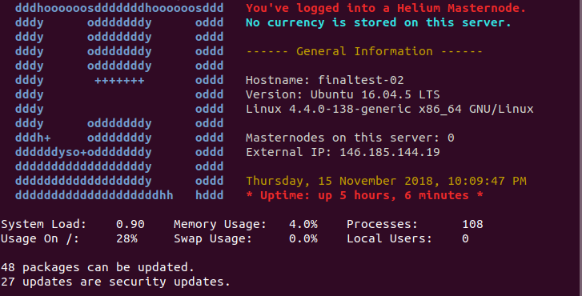

# pimpmynode
A simple script that modifies the welcome message of a Helium masternode on a Ubuntu VPS

This script replaces the standard Ubuntu welcome message with a Helium logo and useful server information through modifying the MOTD files on the VPS. Tested on Vultr and DO. No lag.

**Usage:**

As root:
```
git clone https://github.com/TeelaBrown/pimpmynode.git
cd pimpmynode
bash pimpit.sh
```

Changes will take effect immediately, so there is no need to reboot the VPS. Example:





Use at your own risk :)

With big thanks to AKcryptoGUY.
